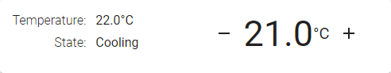

<div align="center">

# Simple Thermostat

### A patched & improved thermostat card for Home Assistant Lovelace UI

[![HACS][hacs-badge]][hacs-url]
[![Home Assistant][ha-badge]][ha-url]
[![Version][version-badge]][release-url]
[![License][license-badge]](LICENSE)

</div>

---

This is a fork of [nervetattoo/simple-thermostat](https://github.com/nervetattoo/simple-thermostat) — a Lovelace card that provides a simpler, more modular thermostat interface for Home Assistant. This fork applies several bug fixes, modernisations, and improvements on top of the last official release.

---

## 🛠️ What's different from the original

This fork modernises [nervetattoo/simple-thermostat](https://github.com/nervetattoo/simple-thermostat) for current Home Assistant versions:

### Modernisation
- **Lit 3 migration** — fully compatible with HA 2024.1+
- **Modern HA components** — `ha-textfield`, `ha-select`, `ha-alert`, `ha-icon-picker` replace removed Polymer elements
- **Modern HA APIs** — `hass.performAction()` (HA 2024.8+), `hass.formatEntityState()` (HA 2022.6+), `hass.localize()` — all with graceful fallback to older APIs
- **Auto-entity selection** — `getStubConfig()` auto-picks the first `climate.*` entity in the HA card picker
- **Custom CSS support** — native `styles:` config key; no card-mod required for per-card overrides
- **Locale-aware number formatting** — temperature display respects the HA user's locale (comma vs. dot as decimal separator)
- **Visual editor** — collapsible sections for Header, Mode Controls, Layout, and Custom CSS; all common options configurable without YAML
- **Modern build tooling** — Node 24, updated Rollup/TypeScript/Jest plugins, `strictNullChecks` enabled, CI workflows

### Bug fixes
- **Temperature display missing** — `setpoints` auto-detection was broken; cards without explicit `setpoints` config showed no temperature
- **Attribute-only sensors crashed** — variable shadowing caused `TypeError` when a sensor used `attribute:` without `entity:`
- **Unknown HVAC modes dropped** — custom firmware modes were silently lost during sort; now appended after known modes
- **Preset/fan/swing modes not translated** — used a legacy HA localisation key that is no longer populated in modern HA
- **`ui.swing_mode` / `ui.preset_mode` missing** — both keys were documented but absent from the template engine, returning `undefined`
- **Toggle/fault entities crash** — `parseToggle` and `parseFaults` threw when the configured entity was offline or removed
- **Template syntax errors crashed card** — a bad Squirrelly template threw uncaught and took down the entire card render
- **`decimals` on formatted sensor values** — applying `decimals` on top of `hass.formatEntityState()` output produced `"N/A"`
- **Editor config mutation** — `valueChanged` and `toggleHeader` operated on the live config object instead of a deep clone
- **Memory leak** — timers and debounce not cleared on disconnect
- **`hass.resources` removed** — replaced with `hass.localize()` which is the current HA API
- **v3 sensor crash when entity offline** — destructuring `undefined` context threw `TypeError`; added early-return guard
- **Fault icons render when entity offline** — `parseFaults` now filters out entities absent from `hass.states`
- **`_hide` accumulated state** — accumulated across config changes instead of resetting to defaults

### UX & accessibility
- **Full keyboard accessibility** — all controls navigable via keyboard, proper ARIA attributes
- **Performance** — `set hass()` short-circuits on unchanged entity state; full recompute only when needed
- **Responsive temperature display** — fluid font size via `clamp()`
- **Smooth UI transitions** — mode buttons animate on hover/press

For the full list of changes see [CHANGELOG.md](CHANGELOG.md).

---

## Table of Contents

- [What's different from the original](#️-whats-different-from-the-original)
- [Requirements](#-requirements)
- [Installation](#-installation)
- [Visual Editor](#-visual-editor)
- [Configuration](#️-configuration)
  - [All options](#all-options)
  - [Layout options](#layout-options)
- [Header config](#header-config)
- [Setpoints config](#setpoints-config)
- [Control config](#control-config)
- [Sensors config](#sensors-config)
- [Templated Sensors (version: 3)](#templated-sensors-version-3)
- [Custom CSS](#custom-css)
- [CSS variables for theming](#css-variables-for-theming)
- [Full config example](#full-config-example)
- [Compact mode](#compact-mode)

---

## 📦 Requirements

- Home Assistant **2024.1** or higher
- HACS (recommended) or manual install

---

## 🚀 Installation

### HACS (recommended)

1. Open **HACS** in Home Assistant
2. Go to **Frontend** → three-dot menu → **Custom repositories**
3. Add this repository URL, category: **Lovelace**
4. Search for **Simple Thermostat** and install
5. Reload the browser

### Manual

1. Download `simple-thermostat.js` from the [latest release][release-url] and place it in `config/www/`.
2. Add to your Lovelace resources:

```yaml
resources:
  - url: /local/simple-thermostat.js?v=1
    type: module
```

---

## 🖱️ Visual Editor

The card has a built-in visual editor accessible from the HA card picker (pencil icon). Most common settings can be configured without touching YAML.

### Sections

| Section | What it does |
|---|---|
| **Entity (required)** | The `climate.*` entity to control |
| **Header** | Show/hide the card header; set a custom name and icon |
| **Header → Toggle entity** | An optional entity (e.g. `input_boolean`, `switch`) shown as an on/off toggle inside the header |
| **Header → Toggle label** | The text displayed next to the toggle switch, e.g. *"Boost"* or *"Night mode"* |
| **Mode Controls** | Show or hide mode button names, icons, and section headings |
| **Layout & Display** | Decimal places for the temperature, unit override, step size (how much ▲/▼ changes the setpoint), and step layout (buttons above/below vs. left/right) |
| **Fallback text** | Text shown instead of "N/A" when the setpoint value is unavailable, e.g. `--` or `Offline` |
| **Custom CSS** | Free-form CSS injected into the card's Shadow DOM — use `--st-*` variables or target any selector. No card-mod required |

> **Tip:** Sensors, faults, and other advanced options can only be configured in the YAML (code) editor. Click **All configuration options** in the editor for the full reference.

---

## ⚙️ Configuration

Minimal config:

```yaml
type: custom:simple-thermostat
entity: climate.my_room
```

### All options

| Option       | Type                  | Default | Description |
| ------------ | --------------------- | ------- | ----------- |
| `entity`     | `string`              | **required** | Climate entity id |
| `header`     | `false\|object`       | —       | See [Header config](#header-config) |
| `setpoints`  | `false\|object`       | —       | See [Setpoints config](#setpoints-config) |
| `layout`     | `object`              | —       | See [Layout options](#layout-options) |
| `service`    | `object`              | —       | Override the HA service call — fields: `domain`, `service`, `data` (object) |
| `unit`       | `string\|false`       | —       | Override or hide the displayed unit |
| `decimals`   | `number`              | `1`     | Number of decimal places |
| `fallback`   | `string`              | `N/A`   | Text when no setpoint is available |
| `step_size`  | `number`              | `0.5`   | Step for temperature up/down |
| `label`      | `object`              | —       | Override `temperature` / `state` labels |
| `hide`       | `object`              | —       | `temperature: bool`, `state: bool` |
| `control`    | `object\|array\|false`| —       | See [Control config](#control-config) |
| `sensors`    | `array\|false`        | —       | See [Sensors config](#sensors-config) |
| `styles`     | `string`              | —       | Custom CSS injected into the card — see [Custom CSS](#custom-css) |
| `version`    | `2\|3`                | `2`     | Set to `3` to enable [Templated Sensors](#templated-sensors-version-3) |
| `variables`  | `object`              | —       | Custom variables available in `version: 3` templates as `v.*` |

### Layout options

```yaml
layout:
  step: row        # row | column — where to render the +/- buttons
  mode:
    names: true    # show mode names
    icons: true    # show mode icons
    headings: true # show mode type headings
  sensors:
    type: list     # list | table
    labels: true   # show sensor labels
```

---

## Header config

Hide the entire header with `header: false`, or configure it:

```yaml
header:
  name: Living Room
  icon: mdi:sofa
  toggle:
    entity: switch.pump_relay
    name: Pump
  faults:
    - entity: binary_sensor.low_battery
      icon: mdi:battery-low
      hide_inactive: true
```

| Option    | Type             | Description |
| --------- | ---------------- | ----------- |
| `name`    | `string`         | Override the card name |
| `icon`    | `string\|object` | Icon next to the name; pass an object to set per-state icons |
| `toggle`  | `object`         | Entity id to show as a toggle in the header |
| `faults`  | `array\|false`   | Binary sensor entities to show as fault indicators |

Icon object keys: `auto`, `cooling`, `fan`, `heating`, `idle`, `off`, `cool`, `dry`, `fan_only`, `heat`, `heat_cool`

---

## Setpoints config

For single thermostats (default):

```yaml
setpoints:
  temperature:
```

For dual thermostats:

```yaml
setpoints:
  target_temp_low:
  target_temp_high:
```

Hide one setpoint:

```yaml
setpoints:
  target_temp_low:
    hide: true
  target_temp_high:
```

---

## Control config

By default the card shows `hvac` and `preset` (if available). Override with an array:

```yaml
control:
  - hvac
  - preset
```

Or use an object for fine-grained control over specific modes:

```yaml
control:
  hvac:
    heat:
      name: Heating
      icon: mdi:fire
    "off":
      name: false   # show icon only
  preset:
    away: true
    none:
      name: Not set
```

> Note: Quote `"off"` and `"on"` to prevent YAML from interpreting them as booleans.

---

## Sensors config

```yaml
sensors:
  - entity: sensor.room_humidity
    name: Humidity
    icon: mdi:water-percent
  - attribute: min_temp
    name: Min temp
    unit: °C
  - entity: sensor.last_changed
    type: relativetime
```

| Option      | Type           | Description |
| ----------- | -------------- | ----------- |
| `entity`    | `string`       | Sensor entity id |
| `name`      | `string`       | Override the display name |
| `icon`      | `string`       | Icon instead of a name |
| `attribute` | `string`       | Use an attribute from the main entity (or the sensor entity if set) |
| `unit`      | `string`       | Unit label (useful when using `attribute`) |
| `decimals`  | `number`       | Round to this many decimal places |
| `type`      | `relativetime` | Display the value as relative time |

---

## Templated Sensors (version: 3)

Set `version: 3` on the card to enable the template sensor system. Templates are evaluated locally using [Squirrelly](https://squirrelly.js.org/) with your entity's state and attributes available as variables.

### Render a state from another entity

The simplest use case — render the state of a different sensor. The two entries below are equivalent (the second uses the default template explicitly):

```yaml
type: custom:simple-thermostat
entity: climate.living_room
version: 3
sensors:
  - entity: sensor.living_room_humidity

  - entity: sensor.living_room_humidity
    template: '{{state.text}}'
    label: '{{friendly_name}}'
```

### Override built-in sensors

Two sensors are built-in by default (`state` and `temperature`). Override them by using their `id`:

```yaml
type: custom:simple-thermostat
entity: climate.living_room
version: 3
sensors:
  - id: state
    label: '{{ui.operation}}'
    template: '{{state.text}}'
  - id: temperature
    label: '{{ui.currently}}'
    template: '{{current_temperature|formatNumber}}'
```

> Use `|formatNumber` on any numeric value to respect your `decimals` config.

### Render attributes from the main entity

All attributes from the climate entity are available directly as variables:

```yaml
sensors:
  - label: Min/max temp
    template: '{{min_temp}} / {{max_temp}}'
  - label: Supported HVAC modes
    template: "{{hvac_modes|join(', ')}}"
```

### Use a different entity as context

Reference another entity — all its attributes become available as variables:

```yaml
sensors:
  - label: Temperature
    entity: sensor.multisensor_living_room
    template: '{{temperature}} {{unit_of_measurement}}'
```

### Pass custom variables

Use `variables` to avoid repeating long strings inside templates. This example replaces the built-in State sensor with a dynamic icon:

```yaml
type: custom:simple-thermostat
entity: climate.living_room
version: 3
variables:
  icons:
    idle: 'mdi:sleep'
    heat: 'mdi:radiator'
sensors:
  - id: state
    label: State
    template: '{{v.icons[state.raw]|icon}}'
```

`v` is the shorthand for your `variables` object. `|icon` renders the string as a HA icon element.

### Available template filters

| Filter         | Description                      | Example |
| -------------- | -------------------------------- | ------- |
| `icon`         | Render as HA icon                | `{{"mdi:sleep"\|icon}}` |
| `translate`    | Look up HA translation string    | `{{"on"\|translate("state.default.")}}` |
| `formatNumber` | Format number to x decimals      | `{{3\|formatNumber({ decimals: 3 })}}` |
| `join`         | Join array to string             | `{{hvac_modes\|join(', ')}}` |
| `css`          | Apply inline CSS styles          | `{{state.text\|css({ color: 'red' })}}` |
| `debug`        | Print value as JSON string       | `{{state\|debug}}` |
| `relativetime` | Render as relative time          | `{{last_changed\|relativetime}}` |

### Translations (`ui` object)

Access HA's built-in climate UI translations via the `ui` shorthand:

| Key             | Value      |
| --------------- | ---------- |
| `ui.currently`  | Currently  |
| `ui.operation`  | Operation  |
| `ui.fan_mode`   | Fan mode   |
| `ui.swing_mode` | Swing mode |
| `ui.preset_mode`| Preset     |

Custom translation lookup: `{{"on"|translate("state.default.")}}` resolves the key `state.default.on` from HA's translation strings.

---

## Custom CSS

Inject arbitrary CSS directly into the card without needing card-mod. Use the `styles` config key or set it via the visual editor:

```yaml
type: custom:simple-thermostat
entity: climate.my_room
styles: |
  ha-card {
    --st-font-size-xl: 24px;
    --st-mode-active-background: #ff5722;
  }
  .current--value {
    font-weight: 700;
  }
```

The CSS is scoped to the card's Shadow DOM. You can override any `--st-*` custom property (see [CSS variables for theming](#css-variables-for-theming)) or target internal selectors directly.

> **Note:** `styles` is applied after all built-in styles, so it always takes precedence. You do not need card-mod for per-card overrides.

---

## CSS variables for theming

| Variable                     | Default                                    | Description |
| ---------------------------- | ------------------------------------------ | ----------- |
| `--st-font-size-xl`          | `clamp(34px, 5vw, 45px)`                  | Target temperature font size (large screens) |
| `--st-font-size-l`           | `clamp(28px, 6vw, 34px)`                  | Target temperature font size (small screens) |
| `--st-font-size-m`           | `20px`                                     | Temperature unit font size |
| `--st-font-size-title`       | `var(--ha-card-header-font-size, 24px)`    | Card heading font size |
| `--st-font-size-sensors`     | `16px`                                     | Sensor value font size |
| `--st-spacing`               | `4px`                                      | Base spacing unit |
| `--st-mode-active-background`| `var(--primary-color)`                     | Background for the active mode button |
| `--st-mode-active-color`     | `var(--text-primary-color, #fff)`          | Text color for the active mode button |
| `--st-mode-background`       | `var(--secondary-background-color)`        | Background for inactive mode buttons |
| `--st-toggle-label-color`    | `var(--primary-text-color)`                | Toggle label text color |
| `--st-font-size-toggle-label`| `16px`                                     | Toggle label font size |
| `--st-fault-inactive-color`  | `var(--secondary-background-color)`        | Fault icon color when inactive |
| `--st-fault-active-color`    | `var(--accent-color)`                      | Fault icon color when active |

### HA theme example

Set variables globally for all Simple Thermostat cards in a theme:

```yaml
my-theme:
  st-font-size-xl: 24px
  st-font-size-m: 20px
  st-font-size-title: 20px
  st-spacing: 2px
```

---

## Full config example

```yaml
type: custom:simple-thermostat
entity: climate.my_room
step_size: 1
sensors:
  - entity: sensor.room_energy
  - entity: sensor.room_power
    name: Energy today
  - attribute: min_temp
    name: Min temp
header:
  faults:
    - entity: binary_sensor.my_room_communications_fault
    - entity: binary_sensor.my_room_low_battery_fault
      icon: mdi:battery-low
  toggle:
    entity: switch.pump_relay
control:
  hvac:
    "off":
      name: Off
      icon: mdi:power
    heat:
      name: Heat
      icon: mdi:fire
```

---

## Compact mode

Hide everything except sensors and temperature control:

```yaml
type: custom:simple-thermostat
entity: climate.my_room
layout:
  step: row
header: false
control: false
```



---

[hacs-badge]: https://img.shields.io/badge/HACS-Custom-41BDF5.svg?style=for-the-badge&logo=homeassistantcommunitystore&logoColor=white
[hacs-url]: https://hacs.xyz
[ha-badge]: https://img.shields.io/badge/Home%20Assistant-2024.1+-41BDF5.svg?style=for-the-badge&logo=homeassistant&logoColor=white
[ha-url]: https://www.home-assistant.io
[version-badge]: https://img.shields.io/badge/version-2.3.0-22c55e.svg?style=for-the-badge&logo=github&logoColor=white
[release-url]: https://github.com/duczz/ha-simple-thermostat
[license-badge]: https://img.shields.io/badge/license-MIT-94a3b8.svg?style=for-the-badge
